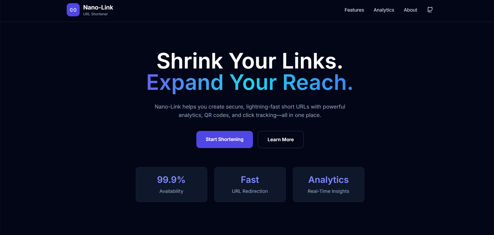

# NanoLink — URL Shortener & Analytics

NanoLink is a full-stack URL shortener I built to actually understand how services like Bitly work under the hood — not just the "generate a random string" part, but the caching, the async analytics, the redirect semantics, all of it.

It's built with Spring Boot on the backend, PostgreSQL for storage, Redis for caching, and a React + Vite frontend. Everything runs in Docker.

---

## Preview




---

## Live Demo

**Frontend:** Deployed on Vercel
**Backend API:** Deployed on Railway

---

## What it does

**Shortening**
You can also request a custom alias. If it's already taken, NanoLink doesn't simply reject the request—it returns five available alternatives, allowing users to choose another alias without retrying manually.

**Redirects**
Redirects check Redis first. On a cache hit, it's basically instant. On a miss, it falls back to PostgreSQL, populates the cache for next time, and returns a 302. Cache entries expire after 24 hours.

**Analytics**
Every click is logged — total count, user agent, IP — but none of that happens on the critical path. It's handled asynchronously with Spring Async so the redirect itself never waits on the analytics write.

**QR Codes**
Every shortened link comes with a QR code you can download in one click. Useful on mobile, and it just makes the whole thing feel more complete.

**Backend**
Standard layered architecture — controllers, services, repositories, DTOs — with a global exception handler so errors come back in a consistent shape instead of raw stack traces.

**Frontend**
Clean, responsive UI with Framer Motion for the small animations, Tailwind for styling, one-click copy for short URLs, and alias suggestion chips when your first choice is unavailable.

---

## Tech Stack

**Backend**

| Technology | Purpose |
|---|---|
| Java 17 | Core language |
| Spring Boot 3.5 | REST API framework |
| Spring Data JPA | Database ORM |
| PostgreSQL | Persistent storage |
| Redis | Caching layer |
| Spring Async | Non-blocking analytics |
| Docker / Docker Compose | Containerization & local orchestration |
| Maven | Build & dependency management |

**Frontend**

| Technology | Purpose |
|---|---|
| React 19 | UI framework |
| Vite | Build tool |
| Tailwind CSS | Styling |
| Framer Motion | Animations |
| Lucide React | Icons |

---

## Architecture

```
+----------------------+
|      React Client     |
|   (Vite + Tailwind)   |
+----------+-----------+
           | HTTP Requests
           ▼
+------------------------------+
|      Spring Boot REST API     |
+---------------+--------------+
                |
    +-----------+-----------+
    |                       |
    ▼                       ▼
PostgreSQL              Redis Cache
(Persistent URLs)     (Cache-aside Pattern)
    |
    ▼
Click Analytics
(Spring Async Logger)
```

---

## How it works

**Creating a short URL**

```
User
  │
  ▼
POST /api/shorten
  │
  Validate URL
  │
  Save temporary record
  │
  Generate Base62 code
  │
  Update database
  │
  Return short URL
```

**Redirect flow**

```
GET /abc123
  │
  ▼
Check Redis
  │
  ├── Hit  → Return immediately
  │
  └── Miss → Check PostgreSQL
                │
                ▼
           Save to Redis
                │
                ▼
           Log analytics (async)
                │
                ▼
           302 redirect
```

---

## Project structure

```
nano-link
│
├── backend
│   ├── src
│   │   ├── config
│   │   ├── controller
│   │   ├── dto
│   │   ├── entity
│   │   ├── exception
│   │   ├── repository
│   │   ├── service
│   │   └── UrlshortenerApplication.java
│   │
│   ├── Dockerfile
│   ├── docker-compose.yml
│   └── pom.xml
│
├── frontend
│   ├── src
│   │   ├── components
│   │   ├── App.jsx
│   │   └── main.jsx
│   │
│   ├── package.json
│   └── vite.config.js
│
├── screenshots
│   └── ui.png
│
└── README.md
```

---

## API

**Create a short URL**

```
POST /api/shorten
```

Request body:

```json
{
  "url": "https://example.com",
  "customAlias": "portfolio"
}
```

Response:

```json
{
  "originalUrl": "https://example.com",
  "shortUrl": "http://localhost:8080/portfolio",
  "shortCode": "portfolio"
}
```

**Redirect**

```
GET /{code}
```

Returns a `302 Found`.

**Analytics**

```
GET /api/analytics/{code}
```

Response:

```json
{
  "shortCode": "portfolio",
  "totalClicks": 15
}
```

---

## Running it locally with Docker

Clone the repo:

```bash
git clone https://github.com/YOUR_USERNAME/nano-link.git
```

Start the backend:

```bash
cd nano-link/backend
docker compose up --build
```

This spins up Spring Boot, PostgreSQL, and Redis together.

Then start the frontend:

```bash
cd ../frontend
npm install
npm run dev
```

Visit `http://localhost:5173`.

---

## Environment variables

**Backend**

```
SPRING_DATASOURCE_URL
SPRING_DATASOURCE_USERNAME
SPRING_DATASOURCE_PASSWORD
SPRING_DATA_REDIS_HOST
SPRING_DATA_REDIS_PORT
APP_BASE_URL
```

**Frontend**

```
VITE_API_BASE
```

---

## A few design decisions worth explaining

**Why Base62 instead of random strings**
Generating a random string and checking for collisions works, but it's wasteful — you can end up retrying multiple times as your table grows. Encoding the auto-incrementing database ID in Base62 sidesteps the whole problem: every code is unique by construction, generation is a single deterministic operation, and there's no retry logic to write or reason about.

**Why Redis, and why cache-aside specifically**
Most short links get clicked many times in a short window right after they're created or shared. Cache-aside means the first request after a cache miss pays the cost of hitting PostgreSQL, but every request after that until expiry is served straight from Redis. In practice, this keeps the database load low even under bursty traffic.

**Why 302, not 301**
This one's easy to get wrong. A 301 tells the browser "this redirect is permanent, remember it yourself" — which means the browser stops sending the request to your server at all after the first hit, and you silently lose the ability to track clicks. A 302 says "this is temporary," so the browser checks in every time, which is exactly what you want for a service where the click itself is the valuable data point.

**Why analytics are async**
Nobody clicking a shortened link should notice or care that you're also logging their IP and user agent somewhere. Spring Async lets the redirect return immediately while the analytics write happens on a separate thread, so tracking never adds latency to the thing the user actually experiences.

---

## What's next

Things I want to add as I keep working on this:

- JWT authentication
- A proper user dashboard
- Link expiration
- Password-protected links
- Custom domains
- Rate limiting
- QR code analytics (scans, not just clicks)
- Geographic analytics
- A production Docker profile
- CI/CD with GitHub Actions
- Kubernetes deployment

---

## Skills this project touches

Java, Spring Boot, REST API design, Docker, Docker Compose, PostgreSQL, Redis, Spring Data JPA, async programming, React, Tailwind CSS, Framer Motion, backend architecture, caching strategy, exception handling, containerization.

---

## Author
**Pranjal**

- GitHub: https://github.com/ooPRANJAL98
- LinkedIn: https://linkedin.com/in/pranjal-~-25689b348
- Email: workforpranjal19@gmail.com

---

